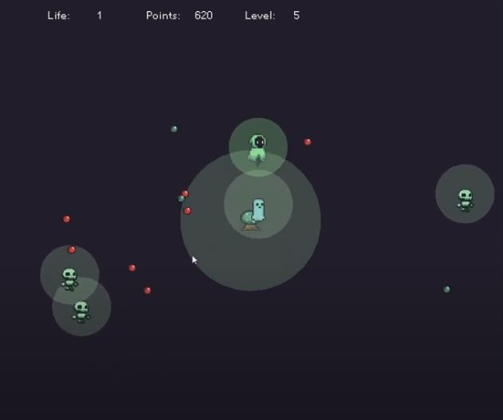

# Roguelike Shoot'em Up – Project for *Structured and Object-Oriented Programming*

## Project Overview

The goal of this project is to create a **roguelike shoot'em up** game using the **SFML** library in C++. The player controls a wizard fighting for survival, using magical projectiles that can only be cast within a specific range — either around a magical orb at the center of the map or near enemies.

Gameplay revolves around defeating waves of enemies, collecting experience points, and upgrading the character by choosing from random bonuses. Enemies become stronger and appear more frequently over time. The player's objective is to survive as long as possible.

## Core Features

- Character movement using `W`, `A`, `S`, `D` keys
- Shooting in the direction of the mouse cursor
- Collision system with enemies and map boundaries
- Multiple enemy types with different behaviors
- Experience and leveling system with randomized upgrades
- HUD displaying health and experience
- Dynamic difficulty progression as the game advances

## Technologies

- Programming Language: **C++**
- Graphics Library: **SFML**

## Demo

https://youtu.be/74DlHHMoaJs

